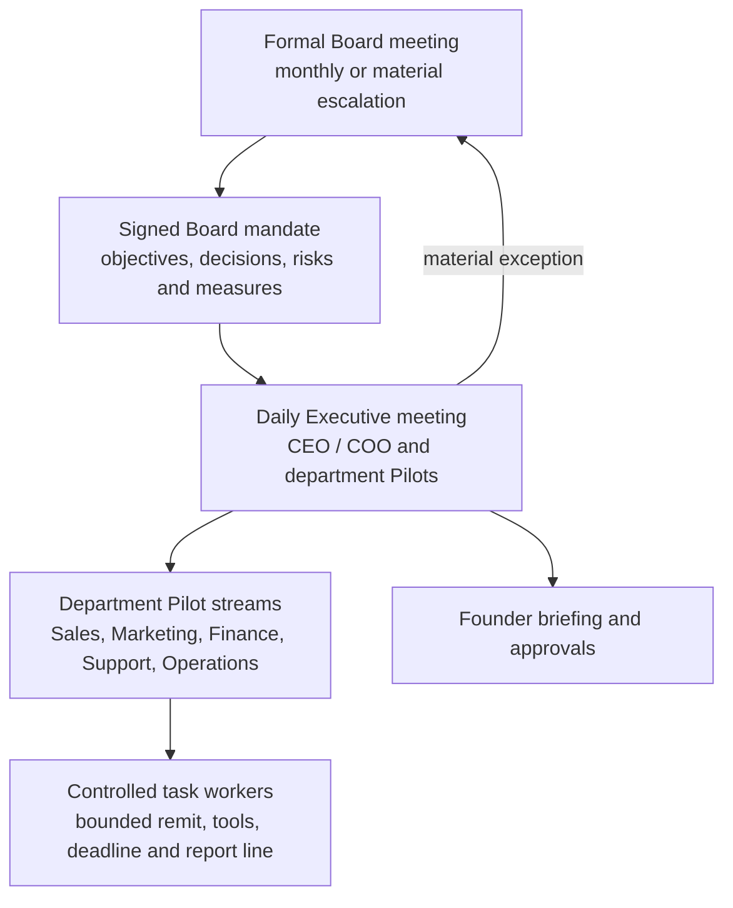

# Tessaris mobile business operating model

## Purpose

Pilot mobile is the founder's private business command centre. It is not a reduced desktop administration product. Desktop configures systems, integrations, automations and detailed records. Mobile receives the current operating picture, supports secure conversations and makes approvals available wherever the founder is.

## Governance hierarchy

AION is the system coordinator. It prepares evidence, preserves decisions and routes work, but does not replace the founder's authority.

## Board meeting

A Board meeting is a formal strategic record, not a general chat room. AION prepares a shared evidence pack from the business map and approved sources. Each Board member supplies an independent view. The meeting is approved, deferred for more evidence, or rejected.

The resulting mandate contains decisions, department objectives, owners, target measures, constraints, evidence references and escalations. Minutes and action receipts remain accessible from every relevant department.

## Executive meeting

The Executive meeting is the daily operating loop, normally chaired by CEO or COO/Operations. It compares yesterday's results and today's plan against the active Board mandate. It resolves routine matters, creates bounded work and escalates only material risks, decisions or mandate changes.

The founder's default mobile conversation is the Executive channel. Department Pilots report through it, so the founder is not flooded with parallel updates.

## Department streams

Each core department has a persistent chat stream, a mandate card, a headline dashboard, an attention queue and receipts. The first supported streams are Sales, Marketing, Finance, Support and Operations.

A direct department chat is a thread with that department's Pilot. It does not create a new autonomous agent.

## Delegated workers and new departments

A work item may create a bounded worker only after a user or authorised Pilot sets its objective, data/tool permissions, expected output, deadline and reporting line. The worker reports to a department Pilot, Operations or AION.

The department library offers Innovation, Technical, Compliance, Legal, Product, Partnerships, Recruitment and Research. A custom department must declare a parent, mandate and permitted capabilities before it can operate.

## Mobile information layout

1. Executive: morning brief, operating exceptions, approvals, Executive chat and current work.
2. Departments: mandate, live metrics, department chat, attention queue and receipts.
3. Board: Board mandate, meeting minutes, strategic decisions, next meeting and material escalations.
4. People: access-controlled search and approved profile views.

No screen invents business data. Until a Node-backed feed is available, it shows its connection state and explains what will appear.
